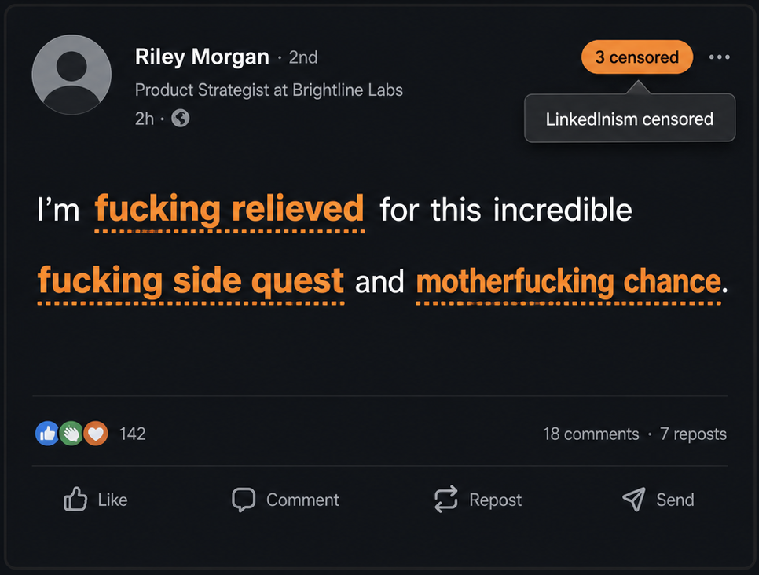

# LinkedInism Censor

LinkedInism Censor is a privacy-friendly Chrome extension that spots corporate clichés in LinkedIn posts and comments and replaces them directly in the feed. It is for anyone who has seen enough *thrilled to announce*, *thought leadership*, *AI is changing everything*, and *agree?* posts for one lifetime.

The extension currently includes **796 detection patterns** across announcements, career journeys, gratitude, lessons, hustle culture, corporate jargon, authenticity, engagement bait, leadership, hiring, sales, AI, productivity, workplace culture, creator-speak, sanitized profanity, and suspiciously exciting “opportunities.”

## Screenshots

### Feed censoring



*Profanity mode keeps the surrounding sentence readable while making each replacement unmistakable.*

### Composer warning


*Typing a detected phrase triggers the intentionally excessive bell disco without changing the draft.*

## Features

### Censors the LinkedIn feed as it changes

- Detects LinkedInisms in posts, comments, and other feed content.
- Replaces only the matched phrase and leaves the surrounding sentence intact.
- Watches LinkedIn's dynamically loaded content, so newly loaded posts and comments are processed without a refresh.
- Highlights each replacement and shows the original phrase in a tooltip when you hover over it.
- Displays a running on-page count of the phrases censored during the current page view.
- Restores the original text immediately when the extension is switched off.

### Warns you before you post one yourself

The extension also checks text entered in LinkedIn's post composer. When a newly typed cliché is detected, it triggers:

- an on-screen **LinkedInism Alert** naming up to three detected phrases;
- a short synthesized audio alarm; and
- an intentionally excessive shower of bells and sirens.

Composer text is inspected but **never changed**. The alarm fires for each new occurrence, including when the same cliché is typed more than once. The visual bell effect is disabled when the operating system's reduced-motion preference is enabled.

### Five replacement styles

Choose a style from the extension popup:

| Style | What it does | Example behavior |
| --- | --- | --- |
| **Asterisks** | Replaces letters and numbers with `*` while preserving spaces and punctuation | `thought leader` → `******* ******` |
| **Cartoon symbols** | Replaces characters with a deterministic mix of `%!#$&@*` | Corporate outrage, newspaper-comic style |
| **Office nonsense** | Produces silly, grammatically shaped rewrites | More than 600 category-aware and generated variations |
| **Profanity** | Rewrites clichés with less corporate and more explicit language | More than 400 generated variations; not suitable for every workplace |
| **Keep + apologize** | Keeps the original phrase and appends a confession | One of 25 self-deprecating apologies |

The funny and profane modes use context-aware rewriting. Noun phrases remain noun phrases, questions remain questions, verb phrases remain usable in their original clause, capitalization is preserved where possible, and common journey and opportunity phrases receive tailored singular or plural replacements.

Replacement selection is deterministic for a given phrase and position, which prevents text from changing randomly whenever LinkedIn updates the page.

### Three detection levels

- **Gentle:** replaces at most one match per text node.
- **Balanced:** replaces at most twenty matches per text block. This is the default and is high enough to cover normal long-form posts.
- **Ruthless:** replaces every non-overlapping match found.

When patterns overlap, the extension favors the longer match. Composer warnings always inspect all matches regardless of the selected feed intensity.

### Simple controls with synced preferences

The toolbar popup provides a master on/off switch, the five replacement styles, and a Gentle, Balanced, or Ruthless detection slider. Preferences are saved with Chrome's sync storage. Changing a setting reprocesses the open LinkedIn page immediately.

## Privacy and permissions

All phrase detection and replacement happens locally in the LinkedIn page. The extension contains no analytics, tracking, remote API calls, or content-upload code. It does not collect or transmit posts, comments, or composer text.

The manifest requests only:

- `storage`, to save the enabled state, replacement style, and detection level; and
- access to `https://*.linkedin.com/*`, so the content script can operate on LinkedIn.

Chrome itself may sync the three preference values through the user's Google account when browser sync is enabled. No LinkedIn text is stored by this extension.

## Install from source

No build step and no package installation are required. The repository contains the complete extension.

### Google Chrome

1. Download or clone this repository:

   ```bash
   git clone https://github.com/OWNER/REPOSITORY.git
   cd REPOSITORY
   ```

   Replace `OWNER/REPOSITORY` with this project's GitHub path. Alternatively, use GitHub's **Code → Download ZIP** option and extract the archive.

2. Open `chrome://extensions` in Chrome.
3. Turn on **Developer mode** in the upper-right corner.
4. Select **Load unpacked**.
5. Choose the repository directory—the folder containing `manifest.json`, not one of its subfolders.
6. Open or reload [LinkedIn](https://www.linkedin.com/).
7. Select the extension's toolbar icon to choose a replacement style and detection level. If the icon is hidden, use Chrome's Extensions menu to pin it.

### Microsoft Edge and other Chromium browsers

The extension uses Manifest V3 and standard Chromium extension APIs. In Edge, open `edge://extensions`, enable **Developer mode**, select **Load unpacked**, and choose the repository directory. Other Chromium-based browsers generally provide an equivalent “load unpacked” workflow, although they are not the primary test target.

### Updating a source installation

1. Pull the latest changes or replace the downloaded project folder.
2. Return to `chrome://extensions` (or the browser's equivalent page).
3. Select the **Reload** button on the LinkedInism Censor card.
4. Reload any open LinkedIn tabs.

### Uninstalling

Open the browser's extensions page and select **Remove** on the extension card. Removing the unpacked extension does not delete the cloned repository; delete that folder separately if you no longer want the source.

## Using the extension

1. Visit the LinkedIn home feed or a page containing posts and comments.
2. Open the LinkedInism Censor toolbar popup.
3. Keep the extension enabled and select a replacement style.
4. Choose the desired detection level.
5. Browse normally. Matches are replaced as content loads, and the badge in the page shows the current total.

Hover over a highlighted replacement to see which original phrase triggered it. Switch the extension off to restore the page's original wording. Settings changes apply without requiring a page reload.

Browser autoplay rules can occasionally prevent synthesized audio until the page has received a user interaction. Visual composer warnings still work when audio is unavailable.

## Project structure

```text
.
├── manifest.json            Chrome Manifest V3 configuration
├── phrases.js              Detection catalog and replacement data
├── content.js              Feed processing, rewriting, and composer warnings
├── content.css             Replacement, counter, and warning styles
├── popup.html              Toolbar popup markup
├── popup.css               Toolbar popup styles
├── popup.js                Preference loading and saving
├── icons/                  Extension icons and source SVG
└── tools/generate-icons.js Dependency-free PNG icon generator
```

The content script scans eligible text nodes rather than replacing a container's HTML. Original text is retained in memory so it can be restored when settings change or the extension is disabled. A `MutationObserver` processes content added by LinkedIn's single-page application.

## Development

There are no runtime dependencies and no compilation or bundling step. Edit the source files directly, reload the extension from `chrome://extensions`, and refresh LinkedIn to test the changes.

To regenerate the checked-in PNG icons from the programmatic icon design, run:

```bash
node tools/generate-icons.js
```

The generator uses only Node.js built-in modules.

### Adding or changing phrases

Detection patterns and category-specific replacement pools live in `phrases.js`. Patterns are regular-expression fragments and are compiled with Unicode-aware, global, case-insensitive flags. Keep these points in mind:

- Prefer specific phrases over broad single words to limit false positives.
- Do not add look-behind or boundary handling to each pattern; the catalog compiler adds Unicode letter-and-number boundaries.
- Put a phrase in the category whose grammatical replacements make sense in a sentence.
- Test capitalization, punctuation, singular/plural forms, overlapping patterns, and text loaded after the initial page render.
- Check all five replacement modes and all three intensity levels.
- Confirm that post-composer text is warned about but never modified.

### Manual test checklist

Before submitting a change:

1. Load the extension with a clean browser profile or reload the unpacked extension.
2. Verify censoring in both a feed post and a comment.
3. Scroll until additional posts load and verify that they are processed.
4. Change modes and intensity levels and confirm the visible text is reprocessed.
5. Disable the extension and confirm that original wording is restored.
6. Type a known phrase in the post composer and confirm the warning appears without altering the draft.
7. Check the extension page for manifest or content-script errors.

## Contributing

Issues and pull requests are welcome. Useful contributions include new high-confidence LinkedInisms, better grammar-preserving replacements, false-positive fixes, accessibility improvements, and compatibility updates for LinkedIn markup changes.

For a pull request, describe the behavior being changed, include representative before/after phrases, and note the browsers and LinkedIn surfaces you tested. Keep changes focused and avoid introducing network services or tracking—the local-only privacy model is a core feature.

## Limitations

- LinkedIn changes its markup regularly, so feed or composer detection may occasionally require selector updates.
- Pattern matching is heuristic. It can miss novel wording or censor an innocent use of a catalogued phrase.
- The extension currently targets LinkedIn's website in Chromium-based browsers; Firefox and LinkedIn mobile apps are not supported by the current manifest.
- Replacements affect only the rendered page. They do not edit the underlying LinkedIn post or comment.

## License

This project is available under the [MIT License](LICENSE).
